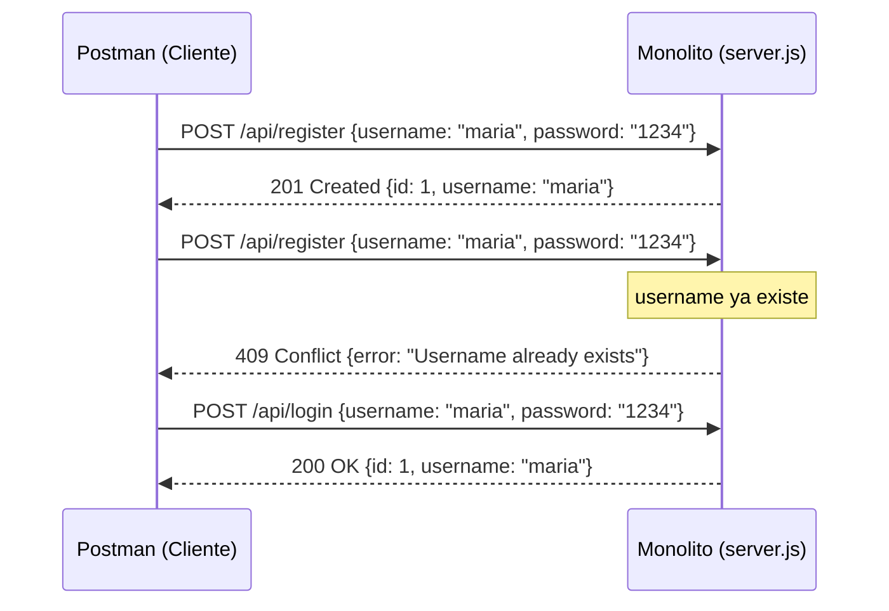
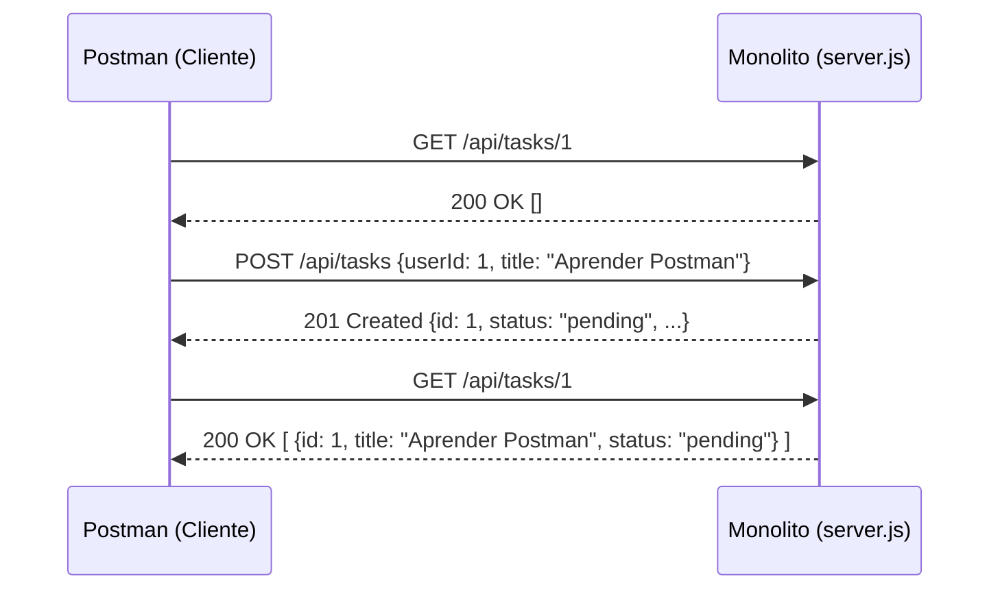
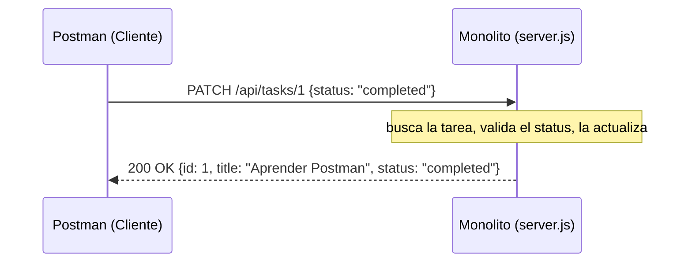

# Práctica 1.5 — Viendo las peticiones HTTP con Postman

## Objetivo

Ver un `GET` y un `POST` **al descubierto** — sin la interfaz de la app de por
medio — para construir el modelo mental que el resto del curso da por
hecho: qué es exactamente una petición, qué es exactamente una respuesta,
y cómo se relacionan en una secuencia de ida y vuelta entre un cliente y
un servidor.

## Qué construimos sobre la práctica anterior

Nada de código nuevo — este es un ejercicio de **observación**, no de
construcción. Usamos exactamente el mismo Monolito de la Práctica 1, sin
tocarle una sola línea. Lo único distinto es la herramienta con la que lo
vemos: en vez del navegador (que oculta la petición dentro de `fetch()` y
la respuesta dentro de `.then()`), usamos Postman, que te muestra ambas
cosas crudas.

## Requisitos previos

- Postman instalado: https://www.postman.com/downloads/ (la versión de
  escritorio gratuita es suficiente).
- Práctica 1 (Monolito) corriendo — este ejercicio **no tiene su propio
  Docker**; reutiliza el contenedor que ya construiste:
  ```
  docker run -p 3000:3000 gestor-tareas-monolito
  ```

## Estructura de archivos

```
01.5-postman-http/
├── README.md
└── postman_collection.json     ← importa esto directo en Postman
```

## Instrucciones paso a paso

1. Con el Monolito corriendo en `http://localhost:3000`, abre Postman.
2. **Importa la colección**: botón "Import" → selecciona
   `postman_collection.json` de esta carpeta. Vas a ver 8 peticiones ya
   armadas, en el orden en que tiene sentido correrlas.
3. Corre cada una **en orden**, de la 1 a la 8, y antes de dar clic en
   "Send", trata de predecir: ¿qué código de estado va a regresar? ¿qué
   va a tener el cuerpo de la respuesta?
4. Presta especial atención a la **petición #3** — es la misma que la #2,
   a propósito, para que veas un `409` real (usuario duplicado) en vez de
   solo respuestas exitosas.
5. En la petición #6 ("Crear una tarea"), copia el `id` que regresa la
   respuesta y confírmalo contra la variable `task_id` de la colección
   antes de correr la #8 ("Completar la tarea").

## Los diagramas de secuencia

Cada intercambio de la colección se puede dibujar como una petición que
sale, y una respuesta que regresa — eso es, literalmente, lo que hace un
diagrama de secuencia. Aquí están los tres flujos que acabas de correr:

### Registro e inicio de sesión (peticiones 2, 3 y 4)



### Crear y listar una tarea (peticiones 5, 6 y 7)



### Completar una tarea (petición 8)



*(GitHub renderiza estos diagramas automáticamente al ver el archivo en el
repositorio. No se necesita ninguna herramienta adicional para verlos.)*

## Qué deberías observar

- **La petición y la respuesta son dos cosas separadas**, cada una con su
  propio contenido. En el navegador, esto queda oculto dentro de una sola
  llamada a `fetch()`.
- **El código de estado HTTP importa tanto como el cuerpo de la
  respuesta.** `201` no es lo mismo que `200`, y ninguno de los dos es lo
  mismo que `409` o `404` — cada uno le dice algo distinto a quien hizo la
  petición, antes incluso de leer el JSON.
- **El servidor no "recuerda" nada entre peticiones por sí mismo.** Cada
  petición en Postman es independiente — el servidor no sabe que la
  petición #4 (login) "viene después" de la #2 (registro); simplemente
  responde a lo que cada una le pide, con lo que tiene guardado en ese
  momento.
- **Un diagrama de secuencia y una colección de Postman son, en el fondo,
  la misma información dibujada de dos formas distintas** — una en código
  ejecutable, la otra en un dibujo para explicarlo a alguien más.

## Errores comunes y solución

| Problema | Causa probable | Solución |
|---|---|---|
| Postman regresa `ECONNREFUSED` o "Could not send request" | El Monolito no está corriendo | Verifica con `docker ps`, o vuelve a correr `docker run -p 3000:3000 gestor-tareas-monolito` |
| La petición #3 regresa `201` en vez de `409` | Reiniciaste el contenedor entre peticiones (los datos son en memoria, se perdió el usuario "maria") | Vuelve a correr la #2 antes que la #3 |
| La petición #8 regresa `404` | El `task_id` de la colección no coincide con el `id` real que regresó la petición #6 | Actualiza la variable `task_id` de la colección con el valor correcto |

## Preguntas de reflexión

1. En la petición #3, el servidor regresó un `409`, no un `500`. ¿Por qué
   crees que existe un código de estado específico para "esto ya existe",
   en vez de usar un error genérico?
2. Si corrieras la petición #6 ("Crear una tarea") tres veces seguidas,
   ¿esperarías tres tareas nuevas o un error? ¿Por qué?
3. Ahora que viste la petición y la respuesta por separado en Postman,
   regresa a `public/app.js` de la Práctica 1 y busca la función
   `handleLogin()`. ¿Dónde, en ese código, está exactamente la petición?
   ¿Dónde está la respuesta?

## Entregable

1. Captura de pantalla de Postman mostrando la petición #3 con su
   respuesta `409` visible.
2. Captura de la petición #8 mostrando la tarea ya como `"completed"`.
3. `REFLEXION.md` con tus respuestas a las 3 preguntas.
