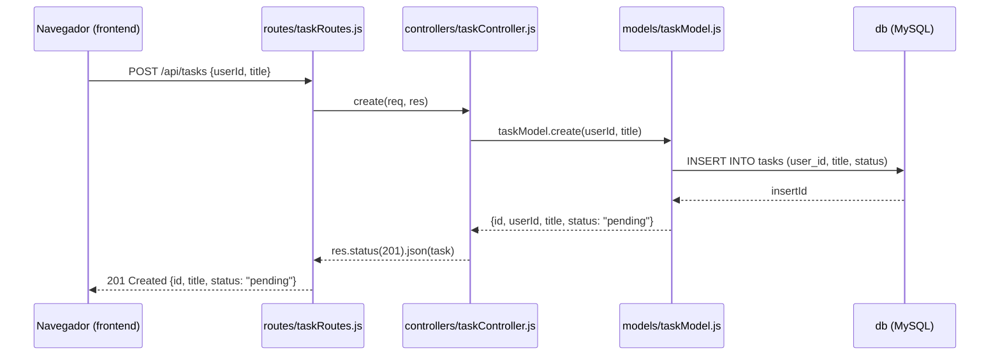
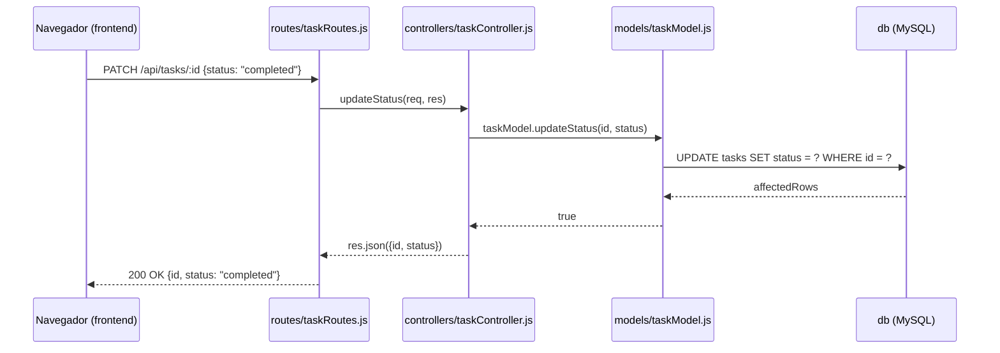

# Práctica 3 — Arquitectura en Capas / MVC

## Objetivo

Reorganizar el backend (hasta ahora un solo archivo con todo mezclado) en
capas con responsabilidades claras, sin cambiar en nada lo que la
aplicación hace desde afuera.

## Qué construimos sobre la práctica anterior

El `frontend/` y el `db/` son **idénticos** a la Práctica 2 — cero
cambios. Lo único que cambia es la organización interna del `backend/`:

| Antes (Práctica 2) | Ahora (Capas / MVC) |
|---|---|
| `server.js` con rutas, validaciones y SQL mezclados | `routes/` → `controllers/` → `models/`, cada uno con una sola responsabilidad |
| Un archivo de ~120 líneas | `server.js` de ~30 líneas que solo arma la aplicación |

**Nota sobre MVC:** este proyecto ya no usa vistas renderizadas en el
servidor (a diferencia del MVC "clásico" con plantillas). La **Vista** es
el `frontend/` que ya tenías — una SPA ("single page application") que consume la API. El **Modelo**
vive en `models/` y el **Controlador** en `controllers/`. Es la forma
moderna de MVC en una arquitectura API + SPA, tan válida como la clásica.

## Requisitos previos

- **Antes de empezar:** si tienes contenedores de otra práctica corriendo,
  ciérralos primero — ver
  ["Flujo de trabajo entre prácticas"](../README.md#flujo-de-trabajo-entre-prácticas)
  en el README raíz.
- Práctica 2 completada.
- Haber revisado la diapositiva **"MVC"** y la tabla **"Capas del modelo
  MVC"**.

## Estructura de archivos

```
03-capas-mvc/
├── docker-compose.yml
├── frontend/                (sin cambios respecto a la Práctica 2 — es la "Vista")
├── backend/
│   ├── Dockerfile
│   ├── package.json
│   ├── server.js             ← solo arma la app, ~30 líneas
│   ├── db.js                 ← conexión a MySQL (único lugar que la crea)
│   ├── routes/                (capa de Presentación: URL + verbo HTTP)
│   │   ├── userRoutes.js
│   │   └── taskRoutes.js
│   ├── controllers/            (el "Controlador": orquesta la petición)
│   │   ├── userController.js
│   │   └── taskController.js
│   └── models/                 (el "Modelo": el único que sabe SQL)
│       ├── userModel.js
│       └── taskModel.js
└── db/
    └── init.sql                (idéntico a la Práctica 2)
```

## Instrucciones paso a paso

1. Abre una terminal en esta carpeta (`03-capas-mvc/`).
2. Levanta los servicios:
   ```
   docker-compose up --build
   ```
3. Abre `http://localhost:8080` — debería verse y comportarse **exactamente
   igual** que en la Práctica 2.
4. Registra un usuario, agrega tareas, marca alguna como completada.
5. Ahora ve al código: abre `backend/routes/taskRoutes.js`, luego
   `backend/controllers/taskController.js`, luego
   `backend/models/taskModel.js` — sigue el camino completo de una
   petición `POST /api/tasks` a través de las tres capas.

## Qué deberías observar

- **La app se comporta idéntico a la Práctica 2** — mismos endpoints,
  mismas respuestas, mismo frontend. Reorganizar en capas no cambia el
  comportamiento externo del sistema; cambia qué tan fácil es mantenerlo.
- **Cada capa solo habla con su vecina.** Las rutas nunca tocan el
  Modelo directamente — siempre pasan por el Controlador. El Controlador
  nunca escribe SQL — siempre se lo pide al Modelo.
- **`server.js` casi no tiene lógica.** Compáralo con el de la Práctica 2:
  ahí vivía todo; aquí solo conecta piezas que viven en otros archivos.
- **Ningún archivo del `frontend/` cambió.** Es la prueba de que separar
  el backend en capas no debería afectar a quien lo consume desde afuera.

## Diagramas de secuencia

Aquí es donde un diagrama de secuencia realmente vale su peso: hace
**visible** la regla de "cada capa solo habla con su vecina" — algo que
en prosa se puede afirmar, pero que en un diagrama se nota de inmediato si
alguien intentara saltarse un paso (como Ruta → Modelo directo, sin pasar
por el Controlador).

### Crear una tarea



### Completar una tarea



Nota la forma de "escalera" del diagrama: cada flecha solo baja o sube un
escalón a la vez — nunca hay una flecha que brinque de `routes` directo a
`db`, saltándose `controllers` y `models`. Esa figura *es* la arquitectura
en capas, dibujada.

## Postman (opcional)

Misma colección que en la Práctica 2 -- el contrato de la API no cambió.
Importa `postman_collection.json` de esta carpeta si quieres correr tú
mismo las peticiones del diagrama de arriba, en vez de solo leerlas.
Opcional, no se califica.

## Preguntas frecuentes sobre el código

**¿Qué hace cada capa, concretamente, en esta aplicación?**

| Capa | Archivo | Qué hace de verdad |
|---|---|---|
| Rutas | `routes/taskRoutes.js` | Declara: "si llega un `POST` a `/`, avísale a `taskController.create`". No sabe qué es una tarea ni cómo se guarda — solo conecta URL + verbo con una función. |
| Controlador | `controllers/taskController.js` | Lee `req.body`, decide si faltan datos (`400` si no hay `title`), le pide al Modelo que haga el trabajo, y traduce el resultado a un código de estado HTTP (`201`, `404`, `500`...). |
| Modelo | `models/taskModel.js` | El único archivo que sabe que existe MySQL, que hay una tabla `tasks`, y qué columnas tiene. Aquí vive el único `INSERT`, `SELECT` o `UPDATE` de todo el flujo de tareas. |

Lo mismo aplica en espejo para `userRoutes.js` → `userController.js` →
`userModel.js`, con login y registro en vez de tareas.

**¿Dónde están las APIs, exactamente?**

No hay un solo lugar — la API es la **suma** de lo que declaran los dos
archivos de rutas:

| Endpoint | Vive en | Lo resuelve |
|---|---|---|
| `POST /api/register`, `POST /api/login` | `routes/userRoutes.js` | `userController.js` |
| `GET /api/tasks/:userId`, `POST /api/tasks`, `PATCH /api/tasks/:id` | `routes/taskRoutes.js` | `taskController.js` |

`server.js` solo decide bajo qué prefijo se "montan" esos archivos de
rutas (`/api` y `/api/tasks`) — ábrelo y busca las líneas `app.use(...)`.

**¿Dónde se ve, en el código, que cada capa solo habla con su vecina?**

No hace falta que lo creas — puedes comprobarlo tú mismo revisando los
`require` de cada archivo:

```
grep "require(" backend/routes/taskRoutes.js
grep "require(" backend/controllers/taskController.js
grep "require(" backend/models/taskModel.js
```

Vas a ver que `taskRoutes.js` solo importa `taskController` (nunca
`taskModel`, nunca `mysql2`); que `taskController.js` solo importa
`taskModel` (nunca `mysql2` directamente); y que solo `taskModel.js`
importa la conexión a la base de datos (`../db`). Esa ausencia de
"atajos" en los `require` — no lo que el código *hace*, sino lo que **no**
importa — es la prueba más directa de que el patrón se está respetando.

## Errores comunes y solución

| Problema | Causa probable | Solución |
|---|---|---|
| `Cannot find module '../models/taskModel'` | Ruta relativa incorrecta al mover/renombrar un archivo | Revisa que la estructura de carpetas coincida exactamente con la de este README |
| Los mismos errores de la Práctica 2 (puerto ocupado, `Access denied`, etc.) | Misma causa que antes — la topología de contenedores es la misma | Revisa el [`FAQ-TECNICO.md`](../FAQ-TECNICO.md) y el README de la Práctica 2 |

## Preguntas de reflexión

1. Si el cliente pidiera agregar "categorías" a las tareas, ¿qué archivo(s)
   tendrías que tocar ahora, comparado con la Práctica 2? ¿Es más o menos
   claro dónde hacer el cambio?
2. ¿Por qué crees que `controllers/taskController.js` no importa
   directamente el módulo `mysql2`? ¿Qué se rompería si lo hiciera?
3. Piensa en tu proyecto real de cliente (el de Ingeniería de
   Requerimientos). ¿Su backend ya está organizado en capas, o todo vive
   en un solo lugar? ¿Qué tan realista es aplicar este mismo reacomodo ahí,
   comparado con aplicar Microservicios o CQRS?

## Entregable

1. Captura de pantalla de la app funcionando en `http://localhost:8080`
   (debe verse igual que en la Práctica 2).
2. Captura de tu terminal mostrando los 4 servicios corriendo
   (`docker-compose ps`).
3. `REFLEXION.md` con tus respuestas a las 3 preguntas.
