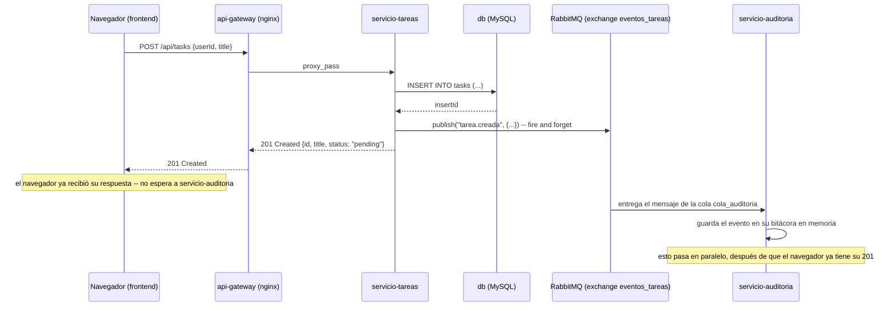
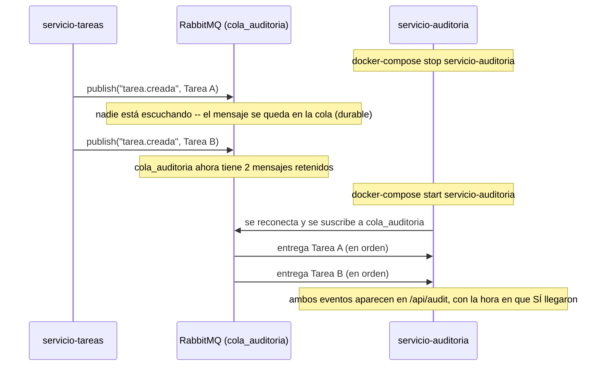

# Práctica 6 — Orientado a Eventos

## Objetivo

Introducir la comunicación **asíncrona** entre servicios: en vez de que un
servicio le hable directamente a otro (como el api-gateway le habla a
servicio-usuarios o servicio-tareas en la Práctica 5), un servicio anuncia
"esto pasó" sin saber ni importarle quién está escuchando, y otros
servicios reaccionan a su propio ritmo.

## Qué construimos sobre la práctica anterior

Reutilizamos servicio-usuarios y servicio-tareas de la Práctica 5 casi sin
tocar nada — mira lo que sigue exactamente igual:

| Pieza de la Práctica 5 | En esta práctica |
|---|---|
| `domain/userDomain.js`, `domain/taskDomain.js` | Idénticos, byte a byte |
| `servicio-usuarios/adapters/dbAdapter.js` y `apiAdapter.js` | Idénticos, byte a byte |
| `servicio-tareas/adapters/dbAdapter.js` | Idéntico, byte a byte |
| `db/init.sql` | Idéntico |
| `api-gateway/nginx.conf` | Solo se le agregó una ruta nueva (`/api/audit`) |

Lo único que cambió en `servicio-tareas` es un adaptador **nuevo**,
`adapters/eventPublisher.js`, y una modificación mínima en
`adapters/apiAdapter.js` para llamarlo. Fíjate en algo importante:
**`domain/taskDomain.js` no recibe el publisher como parámetro.** El
dominio resuelve "crear una tarea" exactamente igual que en la Práctica 5,
sin saber que después alguien va a anunciar ese hecho. Es el
`apiAdapter.js` quien, *después* de que el dominio ya terminó, decide
avisar — el mismo principio de aislamiento del dominio que aprendiste en
la Práctica 4, aplicado ahora a una pieza de infraestructura distinta
(un bus de eventos, no una base de datos).

También aparece una pieza completamente nueva: **`servicio-auditoria`**,
un microservicio que no expone ninguna ruta para "hacer" algo — solo
escucha lo que pasó con las tareas y lo deja consultar. No tiene
`domain/` propio (no protege ninguna regla de negocio, solo lleva un
registro) ni tampoco `dbAdapter.js` — su bitácora vive en memoria, a
propósito (ver "Qué deberías observar" más abajo).

Y el broker que hace posible toda la comunicación: **RabbitMQ**, con un
*exchange* llamado `eventos_tareas` donde `servicio-tareas` publica, y una
cola `cola_auditoria` de la que `servicio-auditoria` consume.

## Requisitos previos

- **Antes de empezar:** cierra los contenedores de la Práctica 5 si siguen
  corriendo — ver
  ["Flujo de trabajo entre prácticas"](../README.md#flujo-de-trabajo-entre-prácticas).
- Práctica 5 completada.
- Haber revisado la diapositiva **"Arquitectura orientada a eventos"**.

## Estructura de archivos

```
06-orientado-a-eventos/
├── README.md
├── docker-compose.yml
├── frontend/                        (idéntico a la Práctica 5 -- cópialo sin cambios)
├── api-gateway/
│   ├── Dockerfile
│   └── nginx.conf                    (+ la ruta /api/audit)
├── servicio-usuarios/                (idéntico a la Práctica 5)
├── servicio-tareas/
│   ├── Dockerfile
│   ├── package.json                  (+ dependencia amqplib)
│   ├── index.js                      (+ inicializa el eventPublisher)
│   ├── domain/
│   │   └── taskDomain.js             ← idéntico a la Práctica 5
│   └── adapters/
│       ├── apiAdapter.js              (+ llama al eventPublisher)
│       ├── dbAdapter.js               ← idéntico a la Práctica 5
│       └── eventPublisher.js          ← NUEVO
├── servicio-auditoria/                ← NUEVO servicio completo
│   ├── Dockerfile
│   ├── package.json
│   └── index.js
└── db/
    └── init.sql                       (idéntico a la Práctica 5)
```

## Instrucciones paso a paso

1. Abre una terminal en esta carpeta (`06-orientado-a-eventos/`).
2. Levanta todo:
   ```
   docker-compose up --build
   ```
   La primera vez puede tardar un poco más que en prácticas anteriores —
   además de tus 3 servicios en Node, Docker también descarga la imagen
   de RabbitMQ.
3. Abre `http://localhost:8080` y usa la app normalmente.
4. Abre `http://localhost:15672` (usuario `guest`, contraseña `guest`) —
   es la interfaz de administración de RabbitMQ. Ve a la pestaña
   **Queues** y deberías ver `cola_auditoria`. Créate una tarea desde la
   app y observa cómo el contador de mensajes sube y baja casi al
   instante.
5. Con Postman o el navegador, visita `http://localhost:4000/api/audit`
   (a través del gateway) y verás el registro de todo lo que
   `servicio-auditoria` ha escuchado.

## Qué deberías observar

- **`servicio-tareas` nunca espera una respuesta de `servicio-auditoria`.**
  A diferencia de la Práctica 5, donde el api-gateway hacía una llamada
  HTTP síncrona y esperaba la respuesta del microservicio correspondiente,
  aquí `servicio-tareas` publica el evento y sigue con su vida
  inmediatamente — no sabe, ni le importa, si `servicio-auditoria` está
  prendido, ocupado, o si tardará un segundo o una hora en procesarlo.
- **Si apagas `servicio-auditoria`, la aplicación sigue funcionando
  perfectamente.** Crear y completar tareas no depende de que
  `servicio-auditoria` esté vivo — a diferencia de la Práctica 5, donde
  apagar un microservicio SÍ rompía la funcionalidad que dependía de él
  (recuerda el `502` de servicio-tareas). Aquí, "nadie está escuchando"
  no es un error.
- **Los eventos no se pierden mientras nadie escucha.** La cola
  `cola_auditoria` es *durable* — RabbitMQ los retiene aunque
  `servicio-auditoria` esté apagado, y se los entrega en cuanto vuelve a
  conectarse. Este es el experimento de la siguiente sección.

### Una bitácora en memoria — otra decisión de diseño deliberada, con un trade-off real

`servicio-auditoria` guarda su registro en un arreglo de JavaScript, no en
una base de datos. Es la misma limitación que viste en el Monolito de la
Práctica 1 — si el contenedor se reinicia, la bitácora en memoria se
pierde — solo que aquí es una decisión consciente sobre *un microservicio
en particular*, no sobre todo el sistema: los datos que sí importan de
verdad (usuarios y tareas) siguen persistidos en MySQL exactamente igual
que en la Práctica 5. Vale la pena que en clase discutan si esto es
aceptable para una bitácora de auditoría real, o si `servicio-auditoria`
debería tener su propia base de datos — y qué significaría, en una
arquitectura orientada a eventos, que cada consumidor sea dueño de su
propio almacenamiento en vez de compartir uno.

### Publicar un evento nunca debe tumbar la operación principal

Prueba desconectando RabbitMQ por completo (no solo apagando
`servicio-auditoria`, sino deteniendo el contenedor `rabbitmq`) y crea una
tarea de todas formas. Sigue funcionando: la tarea se guarda en MySQL y el
api responde `201 Created` con normalidad. `eventPublisher.js` atrapa
cualquier error al publicar y solo lo registra en el log — nunca lo deja
tumbar la petición HTTP. La regla de diseño detrás de esto: el evento es
"avisar a quien le interese", nunca una condición para que la operación de
negocio exista.

## Ventajas de la arquitectura

Vale la pena detenerse aquí antes de ver los diagramas, porque es fácil
quedarse con la idea de "ya vi que es asíncrono" sin ver *para qué* sirve
eso en un sistema real. Esta práctica, a propósito, solo construye un
productor (`servicio-tareas`) y un consumidor (`servicio-auditoria`), pero
la arquitectura es muy util cuando imaginas varios consumidores
a la vez.

**No todo se volvió asíncrono, solo una parte, y ahí está la clave.** El
gateway sigue hablándole a `servicio-tareas` de forma síncrona (si lo
apagas, sigues obteniendo error, igual que en la Práctica 5). Lo que
cambió es únicamente la comunicación *hacia adelante*, del servicio hacia
quien reacciona a lo que hizo. La pregunta que conviene hacerse para
decidir si algo debe ser una llamada síncrona o un evento es: **¿quien
llama necesita la respuesta para poder terminar su propio trabajo, o solo
está avisando de pasada?** Guardar la tarea en MySQL es lo primero
(`servicio-tareas` sí necesita saber si funcionó); avisarle a auditoría es
lo segundo (a `servicio-tareas` no le cambia en nada el resultado).

**La velocidad de la respuesta al usuario deja de depender de la
velocidad del trabajo secundario.** Imagina que en vez de un solo
consumidor tuvieras tres: uno de auditoría, uno que manda un correo de
felicitación, y uno que actualiza un dashboard de estadísticas. Si
`servicio-tareas` tuviera que llamarlos uno por uno y esperar (como en
Microservicios), el usuario se quedaría esperando a que el más lento de
los tres responda —y el correo suele ser el más lento— solo para marcar
una tarea como completada. Con eventos, el usuario recibe su `201`
apenas se guarda en MySQL, y los tres consumidores procesan en paralelo,
a su propio ritmo, sin que a él le importe.

**Agregar (o quitar) quién reacciona a un evento no toca al productor.**
El día que quieras agregar ese servicio de correos, solo escribes el
consumidor nuevo y lo suscribes al exchange `eventos_tareas` -- no tocas
ni un archivo de `servicio-tareas`, no lo vuelves a desplegar, y no
corres el riesgo de que un bug en el código del correo tumbe la creación
de tareas. Eso es particularmente valioso cuando esos consumidores los
construyen equipos distintos dentro de una organización grande: el equipo
de facturación no depende de que el equipo de tareas les dé una API a la
medida ni coordine un despliegue conjunto con ellos.

**Nadie se queda sin su evento por una caída parcial.** Ya lo viste en el
experimento: si el servicio de correos se cayera por mantenimiento una
hora, con llamadas síncronas esos correos simplemente no se mandarían (o,
peor, tumbarían la creación de tareas si el diseño los acopla mal). Con
eventos, se acumulan en su cola durante esa hora, y en cuanto el servicio
vuelve, los procesa todos en orden -- nadie se queda sin su correo, solo
lo recibe tarde.

**El trade-off: no es gratis:** todo esto se gana a
cambio de *consistencia inmediata*. En Microservicios, cuando el
navegador recibe su `201`, sabe con certeza que todo lo relacionado con
esa tarea ya pasó. Aquí, cuando el navegador recibe su `201`, la tarea ya
existe -- pero la auditoría (o cualquier otro consumidor) podría no haber
procesado el evento todavía, **aunque sea por unos milisegundos**, como se ve
en el pico del panel de RabbitMQ. Eso se llama **consistencia eventual**,
y es la idea que se va a retomar más a fondo en la practica CQRS.

## Diagramas de secuencia

### Diagrama 1: flujo normal — publicar no es lo mismo que esperar respuesta



Compáralo con el Diagrama 1 de la Práctica 5: ahí, cada flecha esperaba a
la siguiente antes de continuar. Aquí, la flecha `ST->>MQ` no bloquea a
`ST-->>G` — de hecho, `servicio-auditoria` podría tardar más en procesar
el evento de lo que tarda el navegador en recibir su respuesta, y eso es
exactamente lo esperado.

### Diagrama 2: el experimento — la cola retiene eventos aunque nadie escuche



Este es el experimento que vas a reproducir tú mismo abajo. La diferencia
con el `502` de la Práctica 5 es central: ahí, la caída de un servicio
producía un **error** visible de inmediato. Aquí, la "caída" de un
consumidor no produce ningún error — solo un retraso. Eso es lo que
significa que productor y consumidor estén desacoplados **en el tiempo**,
no solo en el espacio (contenedores distintos).

## Experimento: apagar el consumidor y ver la cola acumularse

1. Con todo corriendo, ve a `http://localhost:15672` → pestaña **Queues**
   y confirma que `cola_auditoria` tiene 0 mensajes.
2. Apaga el consumidor:
   ```
   docker-compose stop servicio-auditoria
   ```
3. Desde la app (o Postman), crea 2 o 3 tareas nuevas.
4. Regresa a la pestaña **Queues** de RabbitMQ y refresca — deberías ver
   que `cola_auditoria` ahora tiene esos mensajes retenidos, esperando.
5. Prende el consumidor de nuevo:
   ```
   docker-compose start servicio-auditoria
   ```
6. Refresca **Queues**: el contador debería volver a 0 casi de inmediato.
   Consulta `http://localhost:4000/api/audit` y confirma que ahí están
   los eventos que creaste mientras estaba apagado.

## Postman (opcional)

La colección de la Práctica 5 sigue funcionando sin cambios para
`/api/register`, `/api/login`, `/api/tasks`. Se agregó una sola petición
nueva: `GET /api/audit`, sin body.

## Errores comunes y solución

| Problema | Causa probable | Solución |
|---|---|---|
| `servicio-tareas` no arranca / se queda esperando | RabbitMQ tardó en levantar y el `healthcheck` de Docker no dio tiempo suficiente | Espera unos segundos más; `docker-compose logs rabbitmq` para confirmar que ya está listo |
| `/api/audit` responde vacío `[]` aunque ya creaste tareas | `servicio-auditoria` se reinició después de crear las tareas, y la bitácora en memoria se perdió | Comportamiento esperado — ver la sección "bitácora en memoria" arriba |
| No puedes entrar a `http://localhost:15672` | El puerto 15672 ya está ocupado por otra cosa en tu máquina | Revisa qué otro proceso lo está usando, o cambia el mapeo de puertos en `docker-compose.yml` |
| Los mismos errores de Docker de siempre | — | Revisa el [`FAQ-TECNICO.md`](../FAQ-TECNICO.md) |

## Preguntas de reflexión

1. En el Diagrama 1, `servicio-tareas` publica el evento y responde
   `201 Created` sin esperar a que `servicio-auditoria` lo procese. ¿Qué
   hubiera pasado si, en cambio, `servicio-tareas` esperara una
   confirmación de `servicio-auditoria` antes de responder al navegador?
   ¿En qué se parecería eso a lo que ya viste en Cliente-Servidor o
   Microservicios?
2. `servicio-auditoria` guarda su bitácora en memoria, no en una base de
   datos. ¿Cuándo sería aceptable esa decisión en un sistema real, y
   cuándo no? ¿Qué tendría que cambiar en el diseño si la respuesta fuera
   "nunca es aceptable perder un evento de auditoría"?
3. Compara el comportamiento de esta práctica cuando apagas
   `servicio-auditoria` contra el comportamiento de la Práctica 5 cuando
   apagabas `servicio-tareas` (el `502`). ¿Por qué el mismo tipo de falla
   —un servicio caído— produce consecuencias tan distintas en cada
   arquitectura?

## Entregable

1. Captura de la app funcionando en `http://localhost:8080`.
2. Captura de la interfaz de RabbitMQ (`http://localhost:15672`) mostrando
   la cola `cola_auditoria`.
3. Captura del experimento: la cola con mensajes acumulados mientras
   `servicio-auditoria` estaba apagado, y luego en 0 después de prenderlo.
4. `REFLEXION.md` con tus respuestas a las 3 preguntas.
