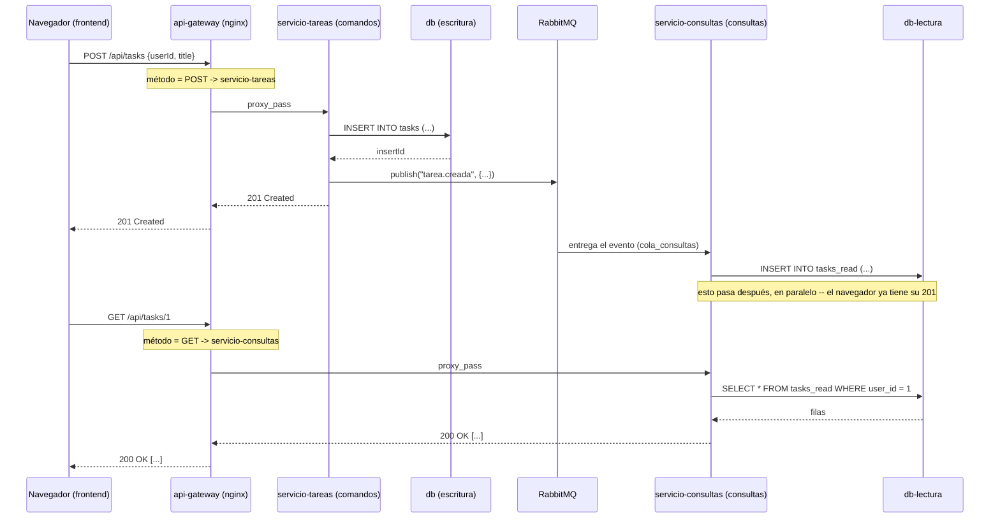
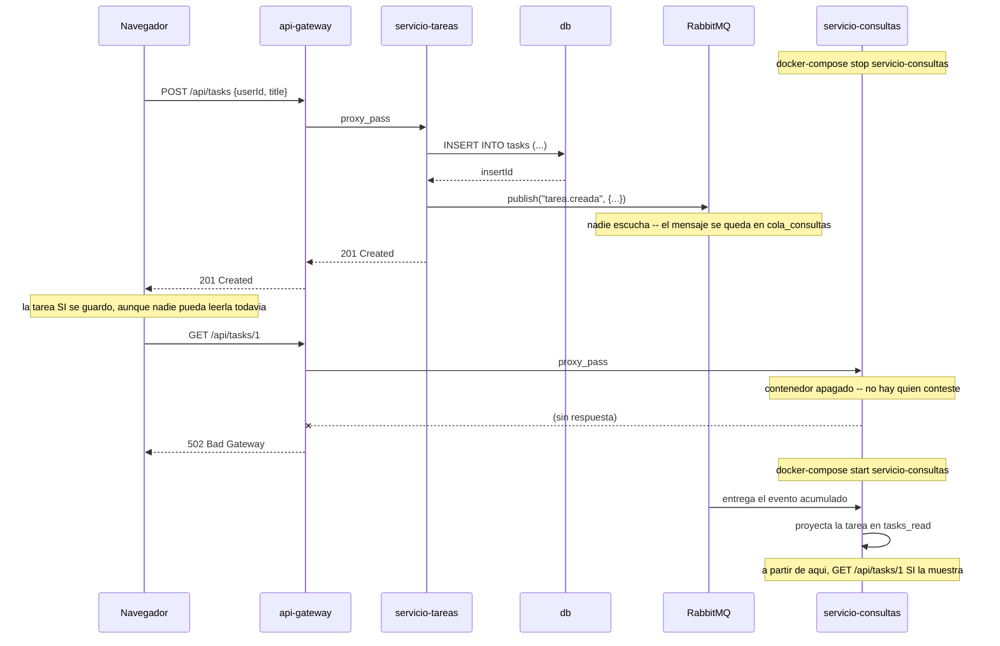

# Práctica 7 — CQRS

## Objetivo

Separar por completo el camino de **escribir** (comandos: crear una
tarea, completarla) del camino de **leer** (consultas: listar las tareas
de un usuario) — con cada uno teniendo su propio servicio y su propia
base de datos. CQRS son las siglas de *Command Query Responsibility
Segregation*: la responsabilidad de comandos y la de consultas quedan
segregadas, no compartidas por el mismo servicio.

## Qué construimos sobre la práctica anterior

Esta práctica nace directamente de una pieza que ya tenías funcionando
desde la Práctica 6: `servicio-auditoria` ya era, sin que lo llamáramos
así, un consumidor que escucha eventos y mantiene su propia vista de los
datos. CQRS es extender esa misma idea, pero ahora para la
funcionalidad *principal* de la app (listar tareas), no solo para un
registro secundario de auditoría.

| Pieza de la Práctica 6 | En esta práctica |
|---|---|
| `domain/taskDomain.js`, `domain/userDomain.js` | Idénticos, byte a byte |
| `servicio-usuarios` completo | Idéntico, byte a byte |
| `servicio-tareas/adapters/dbAdapter.js`, `eventPublisher.js` | Idénticos, byte a byte |
| `servicio-auditoria` completo | Idéntico, byte a byte -- ver más abajo por qué esto es significativo |
| `db/init.sql`, `rabbitmq` | Idénticos |

Lo que sí cambió:

- **`servicio-tareas` perdió una ruta.** Revisa su `apiAdapter.js`: ya no
  existe `GET /api/tasks/:userId`. Sigue siendo el único dueño de `db`
  (nadie más le escribe), pero dejó de responder consultas -- ese dejó de
  ser su trabajo.
- **`servicio-consultas` (NUEVO)** es el lado de lectura. Consume los
  mismos eventos `tarea.creada` y `tarea.completada` que ya publicaba
  `servicio-tareas` desde la Práctica 6, y con ellos construye su propia
  tabla `tasks_read`, en una base de datos **completamente separada**
  (`db-lectura`) -- no es la misma tabla `tasks` duplicada, es una base
  de datos física distinta, con su propio contenedor, su propio usuario,
  su propia tabla. Expone `GET /api/tasks/:userId`.
- **`api-gateway`** separa la ruta `/api/tasks` por **método HTTP**, no
  solo por ruta: `GET` va a `servicio-consultas`, `POST`/`PATCH` van a
  `servicio-tareas`. Revisa `nginx.conf` -- es la primera vez en el taller
  que el enrutamiento depende del verbo, no solo del path.

**Sobre por qué `servicio-auditoria` sin tocar es significativo:** es la
demostración, en código, de la ventaja de la que hablamos para la
Práctica 6 -- agregar un consumidor nuevo (`servicio-consultas`) al mismo
exchange `eventos_tareas` no obligó a cambiar ni una línea de
`servicio-tareas`, ni de `servicio-auditoria`. Ahora hay DOS consumidores
escuchando la misma frecuencia, cada uno con su propia cola
(`cola_auditoria` y `cola_consultas`), sin que se estorben entre sí ni el
productor se entere de que ahora son dos en vez de uno.

## Requisitos previos

- **Antes de empezar:** cierra los contenedores de la Práctica 6 si
  siguen corriendo — ver
  ["Flujo de trabajo entre prácticas"](../README.md#flujo-de-trabajo-entre-prácticas).
- Práctica 6 completada.
- Haber revisado la diapositiva **"CQRS"**.

## Estructura de archivos

```
07-cqrs/
├── README.md
├── docker-compose.yml
├── frontend/                        (idéntico a la Práctica 6 -- cópialo sin cambios)
├── api-gateway/
│   ├── Dockerfile
│   └── nginx.conf                    (/api/tasks ahora se separa por método)
├── servicio-usuarios/                (idéntico a la Práctica 6)
├── servicio-tareas/
│   ├── Dockerfile, package.json
│   ├── domain/taskDomain.js          ← idéntico a la Práctica 6
│   └── adapters/
│       ├── apiAdapter.js              (-- se quitó el GET)
│       ├── dbAdapter.js               ← idéntico
│       └── eventPublisher.js          ← idéntico
├── servicio-auditoria/                (idéntico a la Práctica 6, sin tocar)
├── servicio-consultas/                ← NUEVO servicio completo
│   ├── Dockerfile, package.json
│   ├── index.js                       (consume eventos + expone GET)
│   └── adapters/
│       └── dbAdapter.js               (habla con db-lectura, no con db)
├── db/
│   └── init.sql                       (idéntico -- BD de ESCRITURA)
└── db-lectura/
    └── init.sql                       ← NUEVO -- BD de LECTURA, separada
```

## Instrucciones paso a paso

1. Abre una terminal en esta carpeta (`07-cqrs/`).
2. Levanta todo:
   ```
   docker-compose up --build
   ```
   Vas a ver dos contenedores de MySQL arrancar (`db` y `db-lectura`) --
   es esperado, son dos bases de datos independientes.
3. Abre `http://localhost:8080` y usa la app normalmente -- para el
   usuario, nada se ve distinto.
4. Abre `http://localhost:8081` (phpMyAdmin de `db`, la de escritura) y
   `http://localhost:8082` (phpMyAdmin de `db-lectura`, la de lectura) en
   dos pestañas. Crea una tarea desde la app y compara ambas tablas --
   deberían decir prácticamente lo mismo, pero no son la misma tabla.

## Qué deberías observar

- **`servicio-tareas` ya no puede responder `GET /api/tasks/:userId`.**
  Pruébalo directo (sin pasar por el gateway) contra el puerto interno de
  ese contenedor -- Express te va a responder `404 Cannot GET`. La única
  puerta para leer tareas es `servicio-consultas`.
- **Las dos bases de datos son genuinamente distintas.** No es una tabla
  replicada automáticamente por MySQL -- es `servicio-consultas`, en su
  propio código, quien decide qué escribir en `tasks_read` cada vez que
  le llega un evento. La tabla de lectura hasta tiene una columna que la
  de escritura no tiene (`actualizado_en`), pensada solo para lectura.
- **Hay un instante -- normalmente milisegundos -- en el que la tarea ya
  existe pero todavía no se puede leer.** Justo entre que
  `servicio-tareas` responde `201 Created` y que `servicio-consultas`
  termina de procesar el evento, si alguien preguntara "¿qué tareas
  tiene este usuario?" en ese instante exacto, no vería la tarea
  recién creada. A esto se le llama **consistencia eventual**: eventual
  no porque tarde mucho, sino porque no es *inmediata* -- a diferencia de
  la Práctica 5, donde la respuesta del backend y lo que había en la
  base de datos eran, por construcción, la misma cosa en el mismo
  instante.

### El experimento central: escritura y lectura fallan por separado

Apaga `servicio-consultas` (no `servicio-tareas`) y crea una tarea de
todas formas -- funciona perfecto, la tarea se guarda en `db`. Pero si
en ese momento intentas leer las tareas de ese usuario, el gateway te va
a responder `502 Bad Gateway` -- literalmente el mismo tipo de error que
viste en la Práctica 5 cuando apagabas un microservicio, solo que ahora
afecta *solo a las lecturas*, nunca a las escrituras. Es el experimento
de la siguiente sección.

### ¿Por qué la tabla de lectura no tiene `FOREIGN KEY` ni valida nada?

`servicio-consultas` nunca cuestiona lo que le llega en el evento -- si
el evento dice que existe una tarea con `id: 5` para el `userId: 3`, la
proyecta tal cual. No revalida contra `servicio-usuarios` ni contra
ninguna regla de negocio. Esa validación ya sucedió, una sola vez, del
lado de `servicio-tareas` antes de publicar el evento. Vale la pena que
en clase discutan qué pasaría si un evento llegara corrupto o con datos
inconsistentes -- ¿quién es responsable de esa garantía en una
arquitectura CQRS?

## Diagramas de secuencia

### Diagrama 1: comando y consulta, dos caminos que nunca se cruzan



Fíjate que `servicio-tareas` y `servicio-consultas` nunca se hablan
directamente entre sí, ni una sola vez en todo el diagrama -- su única
conexión es RabbitMQ, exactamente igual que con `servicio-auditoria`
desde la Práctica 6.

### Diagrama 2: el experimento — escritura sobrevive, lectura falla sola



## Postman

La colección se actualizó: las peticiones de `/api/register`,
`/api/login` y `/api/tasks` (POST y PATCH) siguen funcionando igual --
solo cambió, por dentro, a qué servicio llega cada una. Se agregó una
nota explícita en la petición de "listar tareas" advirtiendo que, en
CQRS, puede no reflejar una escritura hecha apenas un instante antes.

## Errores comunes y solución

| Problema | Causa probable | Solución |
|---|---|---|
| `GET /api/tasks/:userId` responde `502` todo el tiempo, no solo al experimentar | `servicio-consultas` o `db-lectura` no terminaron de arrancar | Espera unos segundos y refresca; revisa `docker-compose logs servicio-consultas` |
| Creas una tarea y no aparece de inmediato en la lista | Consistencia eventual -- normal, espera un instante y refresca | Si tarda más de unos segundos, revisa que RabbitMQ y `servicio-consultas` estén sanos |
| `db-lectura` no arranca / puerto ocupado | El puerto `3308` ya está en uso en tu máquina | Revisa qué otro proceso lo usa, o cambia el mapeo en `docker-compose.yml` |
| Los mismos errores de Docker de siempre | — | Revisa el [`FAQ-TECNICO.md`](../FAQ-TECNICO.md) |

## Preguntas de reflexión

1. En el Diagrama 2, la tarea se crea con éxito aunque nadie pueda
   leerla todavía. ¿En qué tipo de aplicación real esto sería
   perfectamente aceptable, y en qué tipo de aplicación sería un
   problema serio? (Piensa en el gestor de tareas vs. un sistema
   bancario.)
2. `servicio-consultas` nunca valida los datos que recibe -- confía
   completamente en que `servicio-tareas` ya los validó antes de
   publicar el evento. ¿Qué ventaja y qué riesgo trae esa decisión?
3. Compara esta práctica con la 5 (Microservicios). En ambas, apagar un
   servicio produce un `502`. ¿Qué es distinto ahora sobre *qué tanto*
   de la aplicación deja de funcionar cuando eso pasa?

## Entregable

1. Captura de la app funcionando en `http://localhost:8080`.
2. Capturas de `db` (puerto 8081) y `db-lectura` (puerto 8082) mostrando
   la misma tarea desde sus dos tablas distintas.
3. Captura del experimento: el `201 Created` al crear una tarea con
   `servicio-consultas` apagado, y el `502` al intentar leerla en ese
   mismo momento.
4. `REFLEXION.md` con tus respuestas a las 3 preguntas.
