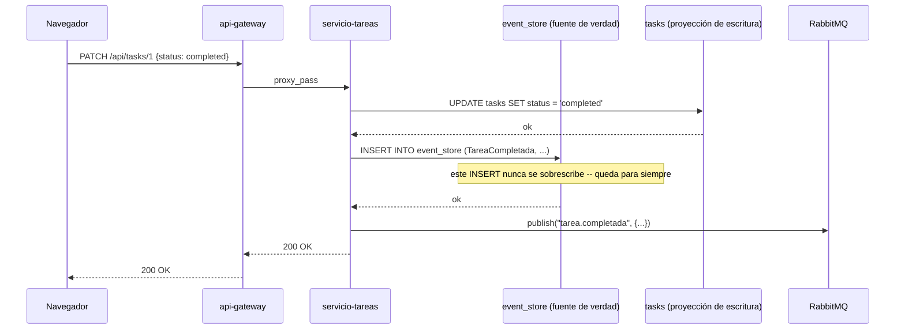
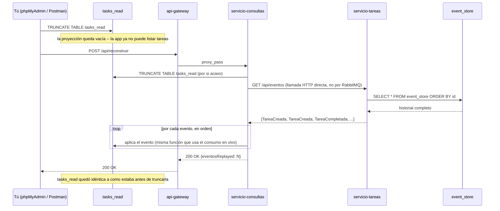

# Práctica 8 — Event Sourcing

## Objetivo

Dejar de tratar el "estado actual" como la fuente de verdad, y tratarlo
en cambio como el **historial completo de lo que pasó**. En vez de
`UPDATE tasks SET status = 'completed'` (que borra para siempre cómo era
el renglón antes), cada cambio se anota como un evento nuevo,
permanente, en un registro que solo crece. Cualquier "estado actual" --
la tabla `tasks`, o `tasks_read` de `servicio-consultas` -- pasa a ser
una **proyección desechable**, siempre reconstruible repitiendo
(*replaying*) ese historial desde el principio.

## Qué construimos sobre la práctica anterior

Nada de la Práctica 7 se quitó -- todo lo que ya tenías sigue
funcionando exactamente igual. Esta práctica **agrega** una capa debajo
de lo que ya existía:

| Pieza de la Práctica 7 | En esta práctica |
|---|---|
| `domain/taskDomain.js`, `domain/userDomain.js` | Idénticos, byte a byte |
| `servicio-usuarios` completo | Idéntico, byte a byte |
| `servicio-tareas/adapters/dbAdapter.js`, `eventPublisher.js` | Idénticos, byte a byte |
| `servicio-auditoria`, `RabbitMQ` | Idénticos, sin tocar |
| `servicio-consultas/adapters/dbAdapter.js` | Casi idéntico -- se agregó un solo método (`vaciar()`) |

Lo nuevo:

- **`event_store`** (tabla nueva, en la base de escritura): **append-only**
  -- nunca se actualiza ni se borra un renglón, solo se agregan más.
  Guarda cada evento como ocurrió: `TareaCreada`, `TareaCompletada`, con
  su `payload` completo. Esta tabla es ahora **la fuente de verdad real**
  del sistema -- `tasks` (la de siempre) pasa a ser oficialmente una
  *proyección*, una copia derivada que se mantiene solo por velocidad.
- **`servicio-tareas/adapters/eventStoreAdapter.js`** (nuevo): agrega el
  método `append()` -- se llama justo antes de publicar a RabbitMQ, en
  las mismas dos rutas de siempre (`POST /api/tasks`,
  `PATCH /api/tasks/:id`). También expone `GET /api/eventos` (todo el
  historial) y `GET /api/eventos/:id` (el historial de una sola tarea) --
  de solo lectura, nunca modifican nada.
- **`servicio-consultas` gana `POST /api/reconstruir`**: el experimento
  central de esta práctica. Vacía `tasks_read` por completo y la vuelve a
  construir desde cero, pidiéndole a `servicio-tareas` el historial
  completo de `event_store` -- no eventos en vivo por RabbitMQ, sino una
  llamada HTTP directa y síncrona entre los dos servicios, pensada
  específicamente para esta operación de recuperación.

**Un detalle de diseño que vale la pena que notes:** la función que
actualiza `tasks_read` a partir de un evento (`proyectarEvento()`, dentro
de `servicio-consultas/index.js`) es **la misma**, sin importar si el
evento llegó en vivo por RabbitMQ o como parte del replay completo desde
`event_store`. Esa es la prueba de que el mecanismo de reconstrucción no
es un camino especial aparte -- es el mismo camino de siempre, solo que
alimentado con datos históricos en vez de datos del momento.

## Requisitos previos

- **Antes de empezar:** cierra los contenedores de la Práctica 7 si
  siguen corriendo — ver
  ["Flujo de trabajo entre prácticas"](../README.md#flujo-de-trabajo-entre-prácticas).
- Práctica 7 completada.
- Haber revisado la diapositiva **"Event Sourcing"**.

## Estructura de archivos

```
08-event-sourcing/
├── README.md
├── docker-compose.yml                (idéntico a la Práctica 7)
├── frontend/                          (idéntico -- cópialo sin cambios)
├── api-gateway/
│   └── nginx.conf                     (+ rutas /api/eventos y /api/reconstruir)
├── servicio-usuarios/                 (idéntico a la Práctica 7)
├── servicio-tareas/
│   ├── domain/taskDomain.js           ← idéntico
│   └── adapters/
│       ├── apiAdapter.js               (+ llama al event store, + GET /api/eventos)
│       ├── dbAdapter.js                ← idéntico
│       ├── eventPublisher.js           ← idéntico
│       └── eventStoreAdapter.js        ← NUEVO
├── servicio-auditoria/                (idéntico, sin tocar)
├── servicio-consultas/
│   ├── index.js                        (+ POST /api/reconstruir)
│   └── adapters/
│       └── dbAdapter.js                (+ el método vaciar())
├── db/
│   └── init.sql                        (+ la tabla event_store)
└── db-lectura/
    └── init.sql                        (idéntico)
```

## Instrucciones paso a paso

1. Abre una terminal en esta carpeta (`08-event-sourcing/`).
2. Levanta todo en los mismos **tres pasos** de la Práctica 7 (evita la
   condición de carrera de RabbitMQ al arrancar todo junto):
   ```
   docker-compose build
   docker-compose up -d rabbitmq
   docker-compose up -d
   ```
3. Usa la app normalmente en `http://localhost:8080` -- crea un par de
   tareas y completa alguna.
4. Con Postman o el navegador, visita
   `http://localhost:4000/api/eventos` -- vas a ver el historial
   completo, en orden, con cada `TareaCreada` y `TareaCompletada` que
   provocaste.

## Qué deberías observar

- **`event_store` nunca se actualiza, solo crece.** Ábrelo en
  `db-admin` (`http://localhost:8081`, tabla `event_store`) y compáralo
  con `tasks` en la misma base -- `tasks` tiene un renglón por tarea que
  se sobrescribe; `event_store` tiene un renglón por *cosa que pasó*, y
  el número de renglones ahí solo puede subir.
- **`GET /api/eventos/:id` te cuenta la historia completa de una tarea.**
  Para una tarea que creaste y luego completaste, vas a ver dos eventos
  -- no puedes saber eso mirando solo la tabla `tasks`, que únicamente
  te dice el estado *final*.

### El experimento central: destruir una proyección y traerla de vuelta

1. Crea un par de tareas y completa alguna desde la app.
2. Confirma el estado en `db-admin-lectura` (`http://localhost:8082`),
   tabla `tasks_read`.
3. **Bórrala por completo** -- desde `db-admin-lectura`, con un
   `TRUNCATE TABLE tasks_read;`, o desde la terminal si prefieres.
4. Refresca la app -- la lista de tareas va a aparecer vacía. Es
   esperado: acabas de borrar la única tabla de la que `servicio-consultas`
   lee.
5. Manda `POST http://localhost:4000/api/reconstruir` (con Postman, o
   `curl -X POST http://localhost:4000/api/reconstruir`).
6. Refresca la app de nuevo -- **tus tareas están de vuelta**, con el
   mismo estado exacto que tenían antes de borrarlas. No se perdió nada,
   porque nunca dependiste de que `tasks_read` sobreviviera -- dependías
   de que `event_store` sobreviviera, y ese nunca se tocó.

Este es el punto central de Event Sourcing: **la proyección es
prescindible; el historial no.** Podrías borrar `tasks_read` todos los
días y nunca perderías información real, siempre que conserves
`event_store`.

### Lo que este experimento NO demuestra (y vale la pena que lo sepas)

`tasks` (en la base de escritura, dueña de `servicio-tareas`) sigue
siendo una proyección igual de desechable que `tasks_read` -- pero esta
práctica no construyó un botón para reconstruirla a ella también, porque
hacerlo dos veces no enseña nada nuevo. Si quisieras comprobarlo tú
mismo, el mismo principio aplicaría: podrías, en teoría, vaciar `tasks` y
reconstruirla repitiendo `event_store` sobre `taskDomain.create()` y
`taskDomain.updateStatus()`, aunque ese ejercicio queda fuera del alcance
de esta práctica.

## Diagramas de secuencia

### Diagrama 1: cada escritura dispara TRES cosas, no dos



### Diagrama 2: el experimento — destruir y reconstruir una proyección



## Postman

Se agregaron dos peticiones nuevas: `GET /api/eventos` (el historial
completo) y `POST /api/reconstruir` (sin body) -- correr esta última
justo después de vaciar `tasks_read` a mano es el experimento completo
de esta práctica, reducido a dos clics en Postman.

## Errores comunes y solución

| Problema | Causa probable | Solución |
|---|---|---|
| `POST /api/reconstruir` responde `500` | `servicio-consultas` no pudo alcanzar a `servicio-tareas` por HTTP directo | Revisa `docker-compose logs servicio-consultas`; confirma que `servicio-tareas` esté sano |
| `GET /api/eventos` responde vacío `[]` aunque ya creaste tareas | Estás corriendo esto contra una base de datos recién creada (volumen nuevo) | Esperado si acabas de hacer `docker-compose down -v`; crea algunas tareas primero |
| Al arrancar, mismo error de RabbitMQ de la Práctica 7 | Ver la fila correspondiente en el README de la Práctica 7 | Sigue el arranque en 3 pasos de la sección de arriba |
| Los mismos errores de Docker de siempre | — | Revisa el [`FAQ-TECNICO.md`](../FAQ-TECNICO.md) |

## Preguntas de reflexión

1. En el experimento, `tasks_read` se pudo reconstruir por completo sin
   perder ni un dato. ¿Qué tendría que ser cierto para que esa
   reconstrucción diera un resultado *distinto* al original? (Piensa en
   el orden de los eventos.)
2. `event_store` solo permite `INSERT` -- nunca `UPDATE` ni `DELETE`.
   ¿Qué ventaja de auditoría/trazabilidad te da eso, que no tenías con
   `tasks` sola? ¿Qué costo tiene (piensa en espacio de almacenamiento a
   largo plazo)?
3. Compara `servicio-auditoria` (Práctica 6) con `event_store` (esta
   práctica). Los dos guardan "lo que pasó". ¿Cuál es la diferencia real
   entre "tener una bitácora de lo que pasó" y "que lo que pasó SEA la
   fuente de verdad del sistema"?

## Entregable

1. Captura de `event_store` en `db-admin` con al menos 3 eventos
   distintos.
2. Captura de `tasks_read` vacía justo después del `TRUNCATE`.
3. Captura de la respuesta de `POST /api/reconstruir` y de `tasks_read`
   ya restaurada, con los mismos datos que antes de borrarla.
4. `REFLEXION.md` con tus respuestas a las 3 preguntas.
